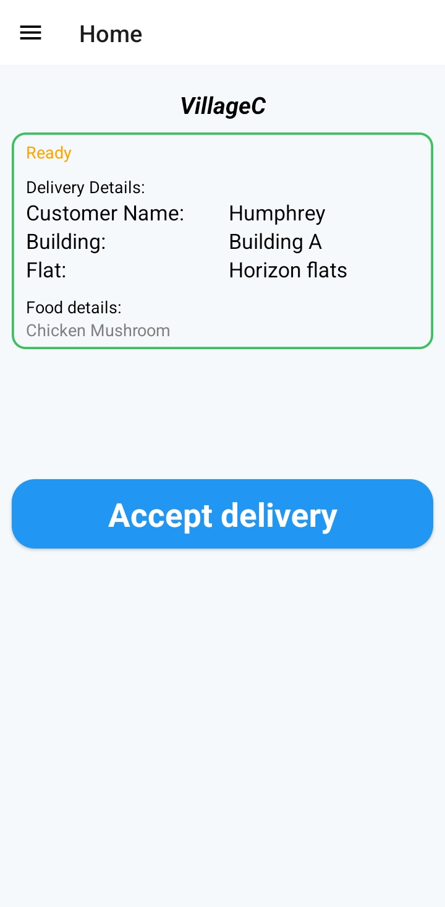
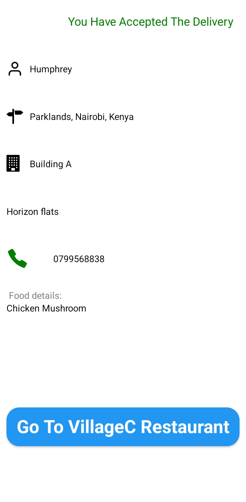
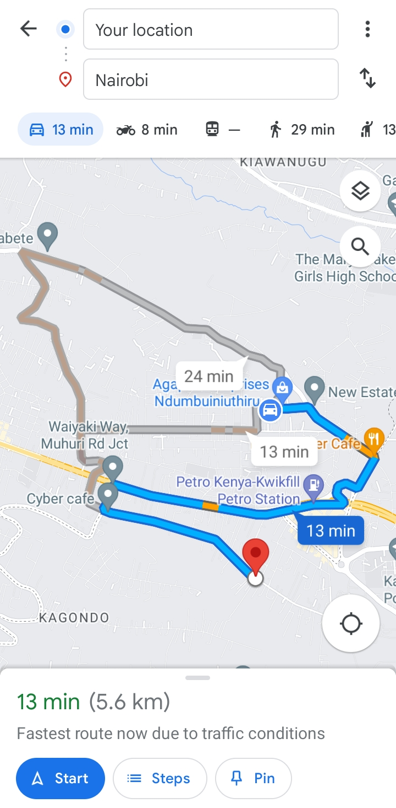
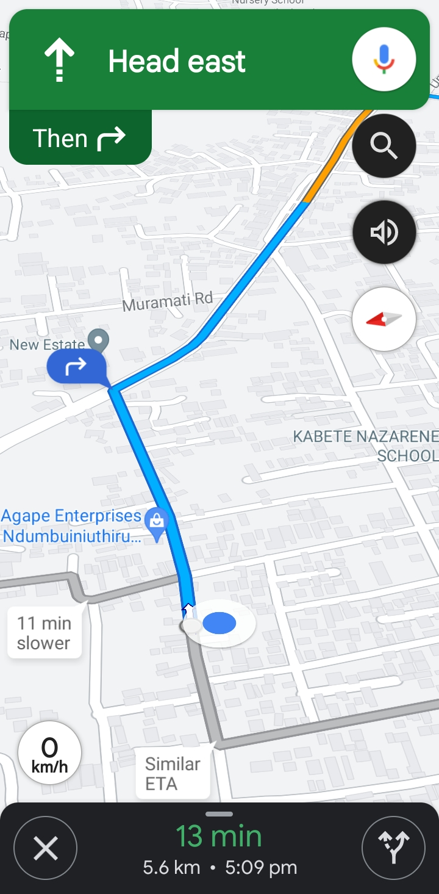
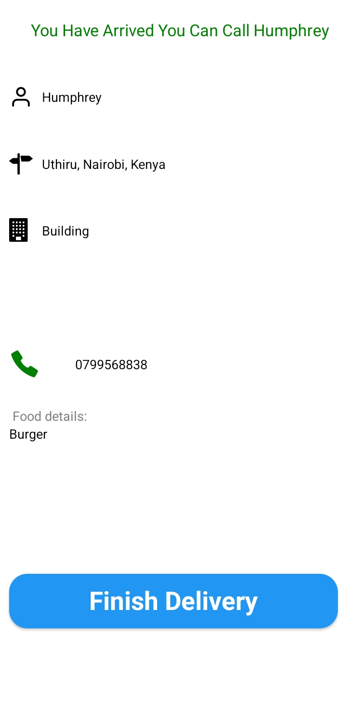
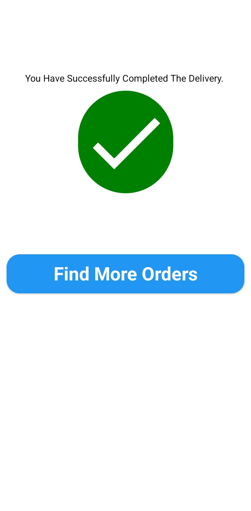
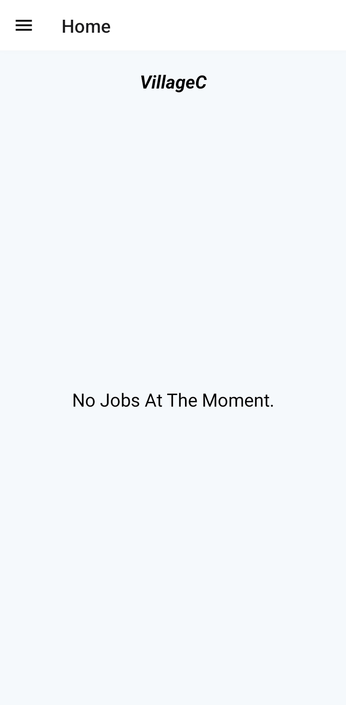
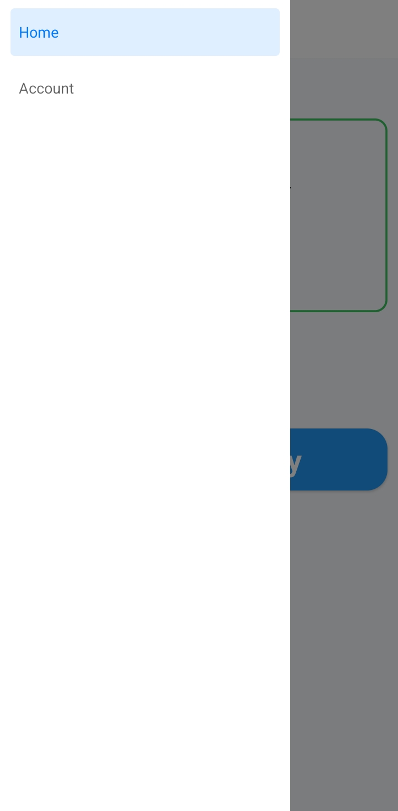
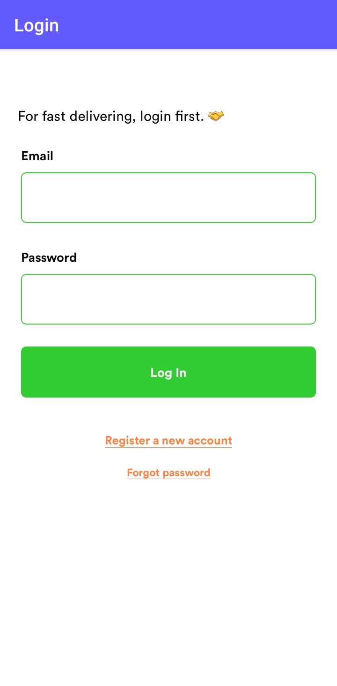
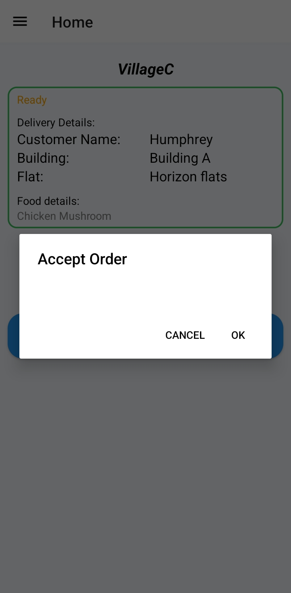

<table>
  <tr>
    <td>Splash Screen</td>
     <td>Home Screen</td>
     <td>Delivery Details</td>
  </tr>
  <tr>
    <td></td>
    <td></td>
    <td></td>
  </tr>
 </table>

 <table>
  <tr>
    <td>Find Route</td>
     <td>Route Found</td>
     <td>Start Navigating</td>
  </tr>
  <tr>
    <td></td>
    <td></td>
    <td></td>
  </tr>
 </table>

 <table>
  <tr>
    <td>Finish Delivery</td>
     <td>Take Photo</td>
     <td>Delivery Details</td>
  </tr>
  <tr>
    <td></td>
    <td></td>
    <td></td>
  </tr>
 </table>
 <table>
  <tr>
    <td>No Jobs</td>
     <td>Navigator</td>
     <td>Account</td>
  </tr>
  <tr>
    <td></td>
    <td></td>
    <td></td>
  </tr>
 </table>

 <table>
  <tr>
    <td>Login</td>
     <td>Accept</td>
  </tr>
  <tr>
    <td></td>
    <td></td>
  </tr>
 </table>
